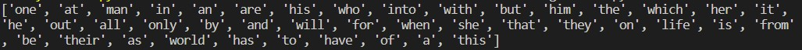
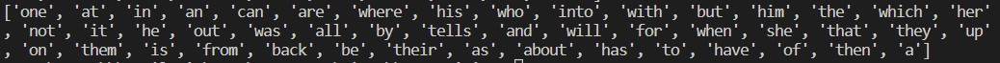
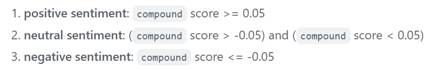
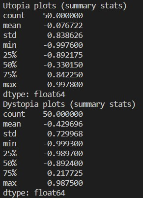
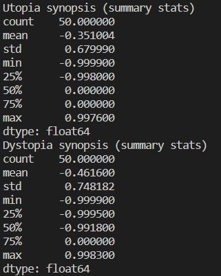

# Analysis of Utopia & Dystopia Movies on IMDb

## Project Overview

In this project, I analyzed similarities and differences related to movies about utopias and/or dystopias. The motivation to that is my LTA class, which is about that them, and has shown me how thin the border between these ideas can be. The data source was the `cinemagoer` package, which provided a range of information about movies and allowed to query on my 2 chosen keywords. The study consisted of analysis across the two categories, be it genre frequency, most common words in the movies' plots and synopsis, and plots' sentiment analysis.

## Implementation

The project's code has two scripts: 
- `start.py` retrieves data from `cinemagoer` and save it in `data` folder
- `movies.py` runs analysis on data saved on `data` folder

I decided to save data beforehand because the package takes too long to retrieve the data. As the focus of the project was on analysis, the text analysis would be iterated much more than querying operations. So, when chosing if I should have all my code in just one script, I decided to prioritize iteration speed. Therefore, I split the code in two files based on two types of functions: *analysis* functions, and *querying* functions. The former constitute `movies.py`, while the latter are in `start.py` along with pickle dump processes. 

The data structures and file types to store data from the package were chosen based on the purpose of the data. For example, for the IDs of Utopia and Dystopia movies, I chose to pickle the list, as accessing the list would be much more important than visualizing it. On the other hand, to movies' plots and synopsis, I decided to save them as .txt files, as this are straightforward to read inside a function, while preserving text format so I could read the source data if I needed to. Similarly, synopsis were saved as txt.

In the analysis functions, I chose to use *dictionaries* as main data structure for frequencies. For example, in genre frequency, the dictionary maps genre to number of movies from the list of IDs with such genre. This allowed for a logical map between categorical data and counting appearences, and smooth sorting process by higher frequency.

Finally, I used Python `pandas` package to get summary statistics from a list of sentiment analysis scores. As the size of both sets were considerable (N = 50), just looking at scores was not enough to compare them. So pandas statistics could provide a quick view of numerical data from a list of scores from NLTK package for sentiment analysis.   

## Results

After doing keyword search for Utopia and Dystopia in IMDb movies and shows' dataset, we get 50 movies in each. First, I checked how many movies where in both. To my surprise, only 3: Watchmen, THX 1138, and Total Recall. 

When looking at **genres frequency**, we learn that 31 out of the 50 utopia movies are in the "Sci-Fi" category, yet, in dystopia they are 43! Indeed, if we look at the other top genres in dystopia, we can have an idea of what Hollywood values in distopian movies: "Sci-fi, Action, Thriller, Drama". On the other side, half (25) of utopian movies are in the "Adventure" genre, showing how utopic stories fit in a lighter spectrum than dystopic ones. Still, genres are mostly similar across these categories, highlighting once again common themes in these stories. 

For **plots and synopsis**, we take a look on which words appear the most. Recalling what they mean, plot is a short description of the main theme of the movie, while synopsis is a much more detailed version of the full story. The method chosen was to check the top 50 words in frequency among plots, and compare across categories, then later do the same for synopsis. 

**Common words in top 50 among utopia vs. dystopia plots (42)**

**Common words in top 50 among utopia vs. dystopia synopsis (47)**

Among plots, the words "man", "life", and "world" appears as common themes in both. These make sense, as the main similarities among these movie categories is the depiction of societies different than ours, so plots should convey this as well. Moreover, words "one", "all" and "only" show how these stories are extremes when compared to other movies. 

However, we can see that top common words in synopsis do not give much insight. Indeed, as these are much longer and descriptive texts than plots, their top words are pronouns, articles, prepositions, etc. Thus, we do not have many noums to draw conclusions on.

Finally, we can look at **sentiment analysis** upon plots and synopsis across categories. The score used here is *compound* from the `Vader Sentiment` package from NLTK toolkit. According to the [package's documentation](https://github.com/cjhutto/vaderSentiment#about-the-scoring), "this is the most useful metric if you want a single unidimensional measure of sentiment for a given sentence". From the documentation, we have the following benchmarks: 

After running compound scores for all plots and synopsis for the 50 movies in each categories, we have the following results:

**Plots sentiment score stats for utopia vs. dystopia**

**Synopsis sentiment score stats for utopia vs. dystopia**

## Reflection

One thing I believe I could have done better was to save more attributes to disk in the `start.py` script. For example, I could have loaded a dictionary for utopia movies with movie IDs as keys, and a value dict with rating, title, genres, among others. I only realized that when I decided to play with ratings in the end of the project, and ended up doing so in the main code. Still, I think going for .txt files for scanning plots and synopsis was a good choice, as it provided me a tangible visualization on what the source data looked like as well Moreover, using `pandas` for summary statistics was also good, because it allowed me to save time on calculations to focus on the analysis itself. 

I believe my scope was good, but looking back my content could have been more insightful if I had chosen different techniques. For example, if focused on studying the relationship between text analysis (sentiment scores) vs film ratings, I could have drawn good insights. Also, I could search for NLP packages to categorize recurring themes, and whether they had an influence on number of ratings in the website, which is a good proxy for popularity. However, I know these could be harder to do, and would switch the attention to data science instead of text functions, which were the focus of the assignment.

All in all, I think I learned how to:
1. Understand the data I need based on the question I want to answer
2. Storing and retrieving data to increase performance to focus on data analysis
3. Manipulate different data structures with functions to find top themes and similarities (intersections)